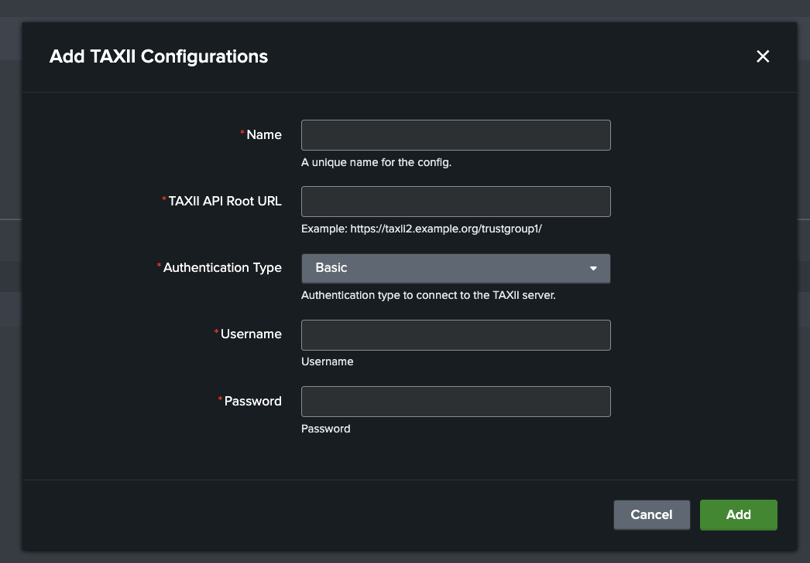

# Configuration

## Network Requirements

The TAXII server must be reachable from the Splunk instance, so please consider:

- Any firewalls which restrict outbound connections from your Splunk environment.
- The TAXII server must accept HTTPS traffic from your Splunk Search Head(s).
- If needed, please contact the ASD CTIS team (or TAXII Server owner) to whitelist your Splunk Search Head(s) IPv4 address(es).

## Setup a TAXII Server Configuration

Start by configuring the TAXII server that will be used to submit STIX bundles.

Navigate to the **Configuration** tab in the app.

Click on the **Add** button to add a new TAXII server configuration.

Clicking on **Add** will verify the connection to the TAXII server including network connectivity and authentication.

HTTP Basic Authentication, API Key and Bearer Token authentication are supported.

## Notes
Proxy server configuration and disabling TLS/SSL verification is not currently supported in this app.

If these or similar network configurations are required, please [raise an issue in the Github repository](index.md#support).

