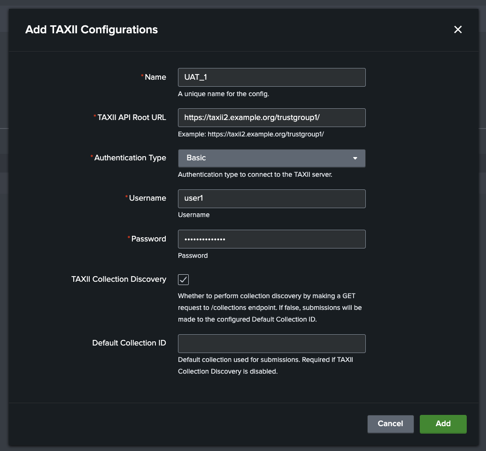
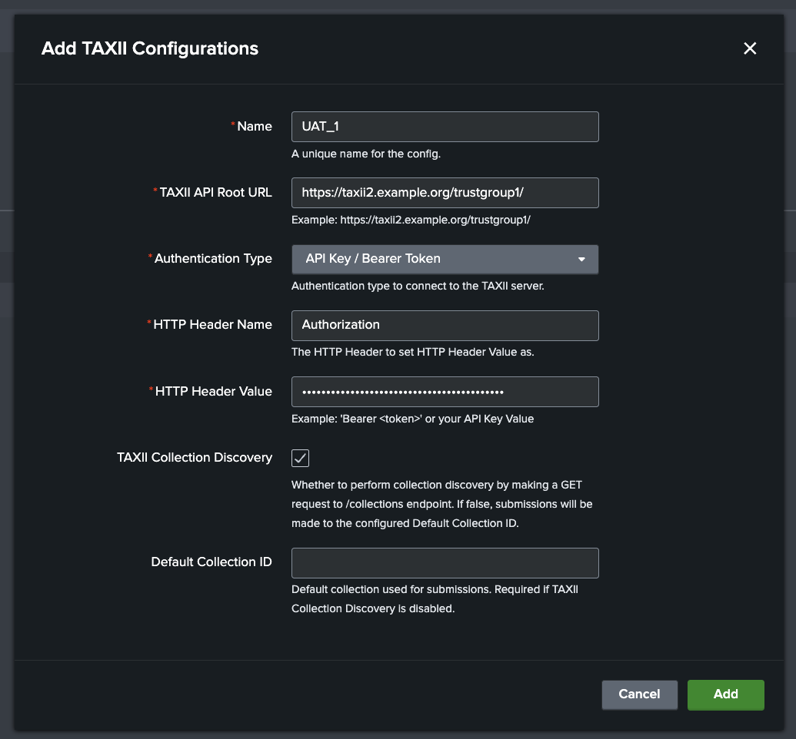
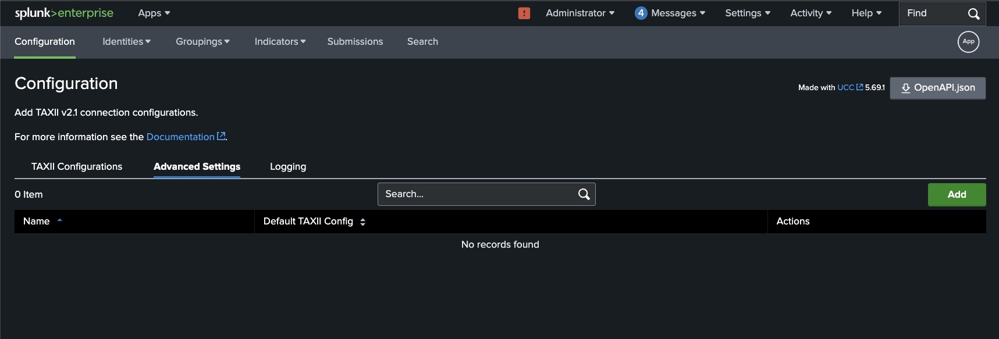
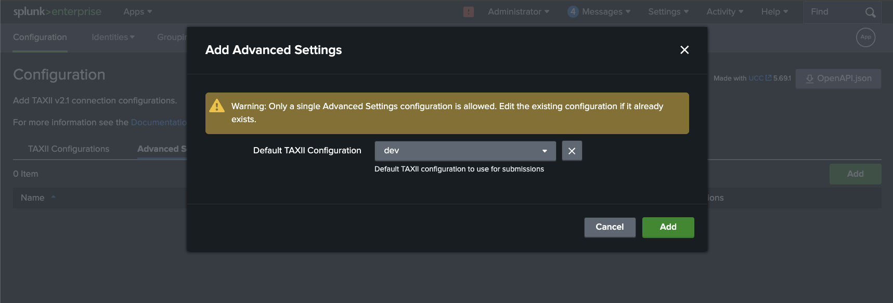

# Configuration

## Network Requirements

The TAXII server must be reachable from the Splunk instance, so please consider:

- Any firewalls which restrict outbound connections from your Splunk environment.
- The TAXII server must accept HTTPS traffic from your Splunk Search Head(s).
- If needed, please contact the ASD CTIS team (or TAXII Server owner) to whitelist your Splunk Search Head(s) IPv4 address(es).

## Setup a TAXII Server Configuration

Start by configuring the TAXII server that will be used to submit STIX bundles.

Navigate to the **Configuration** tab in the app.

Click on the **Add** button to add a new TAXII server configuration.

Fill in the required fields:

- Name: A unique name for the configuration, which becomes the stanza name in the configuration file.
- TAXII API Root URL: The API Root URL for the TAXII Server you would like to use for CTI submissions.
- Authentication Type: The type of authentication required by the TAXII Server. This can be 'Basic' or 'API Key/Bearer Token'

If you select 'Basic' authentication, you will be prompted to enter a username and password.

If you select 'API Key/Bearer Token' authentication, you will be prompted to enter the 'HTTP Header Name' and 'HTTP Header Value' for authentication.

Clicking on **Add** will verify the connection to the TAXII server including network connectivity and authentication.

## Advanced Configuration

### Optional TAXII Configuration fields to configure

- TAXII Collection Discovery: This should be enabled, unless your TAXII server credential does not have permission to access the `GET {api_root}/collections` endpoint.
- Default Collection ID: Is only required if TAXII Collection Discovery is disabled. This should be the default collection ID that you want to submit STIX bundles to.

Authentication is verified by making a GET request to the TAXII server:

- If 'TAXII Collection Discovery' is enabled, a GET request is made to `{api_root}/collections`.
- Otherwise a GET request is made to `{api_root}/collections/{default_collection_id}`.

### Default TAXII Configuration
You can configure a default TAXII server configuration which is used for submissions.

To configure this go to the 'Advanced Settings' tab.
If there is no existing configuration, press the 'Add' button. Otherwise, edit the existing configuration.

Choose an existing TAXII server configuration from the 'Default TAXII Configuration' dropdown and click 'Add' or 'Update'.

## Notes
Proxy server configuration and disabling TLS/SSL verification is not currently supported in this app.

If these or similar network configurations are required, please [raise an issue in the Github repository](index.md#support).

